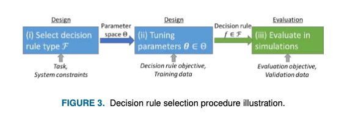

# Model-Based Deep Learning: On the Intersection of Deep Learning and Optimization
**Summary of the paper [Model-Based Deep Learning: On the Intersection of Deep Learning and Optimization published in IEEE Signal Processing Magazine](https://arxiv.org/abs/2205.02640), 2022, by [Nir Shlezinger](https://arxiv.org/search/eess?searchtype=author&query=Shlezinger,+N), [Yonina C. Eldar](https://arxiv.org/search/eess?searchtype=author&query=Eldar,+Y+C), and [Stephen Boyd](https://arxiv.org/search/eess?searchtype=author&query=Boyd,+S+P).**


## 1.0 Introduction

In the ever-evolving world of artificial intelligence and machine learning, two powerful approaches have emerged: model-based optimization and deep learning. Model-based methods rely on mathematical models and domain expertise to craft precise solutions. They shine in interpretability and reliability but often struggle with the complexities of real-world data. On the other hand, deep learning 🌟 has revolutionized fields like computer vision and natural language processing, uncovering patterns in massive datasets. Yet, these **black-box** systems can be hard to interpret and resource-intensive.

💡 What if we could combine the best of both worlds? That’s the idea at the heart of the paper **“Model-Based Deep Learning: On the Intersection of Deep Learning and Optimization”** by **Shlezinger, Eldar, and Boyd**. This work explores how blending the mathematical rigor of optimization with the adaptability of neural networks creates hybrid systems that are not only powerful but also practical.

In this blog, I’ll break down the key ideas, methods, and real-world examples from this fascinating paper. From understanding decision-making as a continuous spectrum to exploring techniques like deep unfolding and DNN-aided optimization 🤖, we’ll see how this innovative approach is reshaping areas like medical imaging 🩻, digital communications, and control systems 🚗.

Whether you’re just starting out or diving deeper into AI, this blog will guide you through the exciting possibilities of model-based deep learning. Let’s explore this game-changing intersection together! 🎉

## 1.2 Decision Making: The Core of Model-Based Deep Learning

At its heart, decision-making involves designing a mapping that takes available information _(the context)_ and transforms it into an actionable outcome _(the decision)_. Whether we’re classifying images, controlling vehicles, or managing financial trades, the challenge boils down to creating an effective decision rule—a mathematical function that translates inputs into outputs.

In the paper “Model-Based Deep Learning: On the Intersection of Deep Learning and Optimization,” the authors introduce a unified framework for understanding and designing decision-making algorithms. This framework categorizes decision-making strategies along a spectrum, varying in specificity and parameterization. Let’s break it down step by step.

---

### 1.2.1 The Anatomy of Decision Making

The goal of decision-making is to design a rule

```math
f : X \to S
```

- X is the **context space** _(e.g., sensor readings, financial data, or low-resolution images)._
- S is the **decision space** _(e.g., control actions, trade lists, or high-resolution images)._

Examples of decision-making tasks include:

- **Signal Processing**: Denoising an audio signal 🎵
- **Communications**: Decoding transmitted messages 📡
- **Vehicular Control**: Determining steering angles and throttle 🚗
- **Finance**: Deciding which stocks to buy or sell 📈

Each decision-making process relies on three fundamental components:

1. **Decision Rule Type**: The structure of the rule (e.g., linear, tree-based, neural network).
2. **Objective**: The criteria used to evaluate the performance of the decision rule.
3. **Evaluation Procedure**: How the rule is tested and validated, often using simulations.

4. **Super-Resolution**: Here, $s$ is a high-resolution image, while $x$ is a distorted low-resolution version of the image. Thus, $X$ and $S$ are the spaces of low-resolution and high-resolution images, respectively. Such decision rules, typically referred to as recovery methods, aim at reconstructing $s_{true}$ from its distorted version $x$, as illustrated in Fig. 1.
   - 
5. **Stochastic Control**: In this example, we consider a dynamic system, where the decision rule is a control policy. At each time period $t$, the goal is to map the noisy state observations $x_t$, where $X$ is the space of possible sensory measurements, into an action $s_t$ within an action space $S$. The system is characterized by a latent state vector $z_t$ that evolves in a random fashion which is related to the previous state $z_{t−1}$ and action $s_{t−1}$, while being partially observable via the noisy $x_t$. This setup is illustrated in Fig. 2.
   - 
---

### 1.2.2 Types of Decision Rules

Decision rules can take on various forms, from simple to complex. Here are a few:

- **Affine Rules**: Straightforward linear transformations, such as $ s={Wx + b}$.
- **Decision Trees**: Rules that involve nested conditions, like “if this, then that.”
- **Optimization-Based Rules**: Solving a mathematical problem to find the best decision.
- **Iterative Algorithms**: Refining decisions step-by-step through repeated computations.
- **Neural Networks**: Deep learning models with multiple layers and a large number of parameters.

Each type has its strengths and limitations. For instance, affine rules are fast and interpretable but limited in complexity, while neural networks are highly flexible but can be difficult to interpret.

---

### 1.2.3 Designing and Evaluating Decision Rules

Creating a decision rule is a three-step process:

1. **Select the Rule Type**: Decide the structure of the mapping _(e.g., neural network or optimization-based)._
2. **Tune Parameters**: Use training data to adjust the parameters of the rule _(e.g., weights in a neural network or hyperparameters in an optimization algorithm)._
3. **Evaluate the Rule**: Test its performance using simulations or validation data.

For example, in a super-resolution task, the context **$x$** could be a low-resolution image, and the decision **$s$** would be the high-resolution output. The decision rule might involve an optimization-based iterative algorithm or a deep neural network trained on image data.

- 

### 1.2.4 Model-Based vs. Data-Centric

Traditional **model-based methods** focus on using domain knowledge to create decision rules, relying on simplified mathematical models. In contrast, **data-centric deep learning** trains highly parametric decision rules from large datasets without explicitly defining a model.

The key insight of this paper is that <ins>these approaches are not opposites but rather two ends of a spectrum </ins>. **Model-based deep learning** leverages the strengths of both, using data to tune decision rules while retaining the interpretability and structure of model-based methods.

Next, we’ll dive deeper into specific examples of decision-making techniques, showing how this hybrid approach is applied in real-world scenarios like image super-resolution, stochastic control, and more. 
## 1.3 Model-Based Methods: Leveraging Mathematical Precision

Model-based methods form the foundation of many classical decision-making techniques, relying on mathematical models and domain knowledge to craft solutions. These approaches aim to create a decision rule by formulating and solving an optimization problem based on a well-defined objective. While powerful and interpretable, model-based methods often face challenges when real-world scenarios deviate from their underlying assumptions.

---

### 1.3.1 The Basics of Model-Based Methods

The essence of model-based methods lies in designing a decision rule objective—a mathematical formulation that captures the task at hand. This involves:

1. **Modeling the Problem**: Define a mathematical representation of the system, often using domain knowledge.
2. **Formulating the Objective**: Create an optimization problem based on a loss function or cost that reflects the desired outcome.
3. **Solving the Optimization Problem**: Derive the optimal decision rule by solving the formulated problem.

For example:

- In super-resolution, the goal might be to reconstruct a high-resolution image $s$ from its low-resolution version $ x$ . A common model assumes $x = Hs + w$ , where $H$ is a known degradation matrix and $w$ represents noise. The optimization objective could minimize reconstruction error and enforce sparsity in the solution

---

### 1.3.2 Decision Rule Objectives

The decision rule objective is a mathematical expression used to select the best decision rule from a set of candidates. It typically involves:

- **Surrogate Models**: Simplified approximations of the real-world problem.
- **Regularization Terms**: Penalties to encourage desired properties _(e.g., sparsity or smoothness)._

For instance, in a linear Gaussian model for super-resolution, the decision rule objective might look like:

```math
L(s) = \frac{1}{2} \| x - Hs \|^2 + \lambda \| s \|_0,
```

where $\| s \|_0$ enforces sparsity, and $\lambda$ controls its strength.

This framework allows model-based methods to strike a balance between accurately representing the task and ensuring computational feasibility.

---

### 1.3.3 Types of Model-Based Decision Rules

Model-based methods often lead to specific types of decision rules, depending on the complexity of the problem:

1. **Explicit Solutions**: For simple objectives, solutions can be directly computed.
   - _Example: In linear-quadratic control, the Kalman filter provides an explicit linear mapping for state estimation._
2. **Iterative Algorithms**: For more complex problems, decision rules involve iterative solvers that refine the solution step by step.
   - _Example: The Alternating Direction Method of Multipliers (ADMM) iteratively solves optimization problems for sparse recovery._

---

### 1.3.4 Strengths of Model-Based Methods

1. **Interpretability**: The decision rules and their parameters have clear meanings, derived from the problem’s mathematical formulation.
2. **Flexibility**: By modifying the objective or its parameters, the method can adapt to various scenarios.
3. **Theoretical Guarantees**: Many model-based methods offer provable convergence and optimality under specific conditions.

---

### 1.3.5 Challenges of Model-Based Methods

1. **Model Mismatch**: Simplifying assumptions _(e.g., Gaussian noise, linearity)_ often fail to capture the complexity of real-world data.
2. **Parameter Sensitivity**: The performance heavily depends on the accuracy of parameters like noise variance or model coefficients, which are often estimated with uncertainty.
3. **Computational Cost**: Iterative solvers can be slow, particularly for high-dimensional problems.

✨ A Hybrid Perspective

While model-based methods excel in interpretability and reliability, their limitations highlight the need for enhancement. By integrating data-driven techniques, such as deep learning, **model-based methods** can become more robust and adaptable. This hybridization forms the basis of model-based deep learning, which we’ll explore further in the context of combining optimization and neural networks.

In the next section, we’ll delve into **deep learning approaches** and examine how they contrast with and complement model-based methods. Stay tuned for the exciting interplay between these two worlds! 🌟

In the next section, we’ll delve into deep learning approaches and examine how they contrast with and complement model-based methods. Stay tuned for the exciting interplay between these two worlds!

## 1.4 Deep Learning: Data-Driven Decision Making

---

Deep learning has revolutionized how we approach decision-making, offering the ability to model complex patterns in data without relying on explicit mathematical formulations. Unlike traditional model-based methods, which depend on domain knowledge and simplified models, deep learning leverages neural networks trained on large datasets to learn decision rules directly from data. This flexibility has made deep learning the go-to approach for tasks like computer vision, natural language processing, and beyond.

---

### 1.4.1 The Core of Deep Learning

At its essence, deep learning uses deep neural networks (DNNs) to approximate the decision rule $f : X \to S$. These networks consist of layers of interconnected neurons, each performing a nonlinear transformation on the input data. By adjusting the weights and biases of these connections, DNNs can learn highly complex mappings.

For instance:

- In a super-resolution task, a DNN might take a low-resolution image $x$ as input and output a high-resolution version $s$ , learning the mapping directly from examples in the training dataset.

---

### 1.4.2 Decision Rule Objective

Deep learning shifts the focus from explicit models to **data-driven objectives**. Instead of relying on a predefined mathematical model, the decision rule is optimized by minimizing the empirical risk:

```math

L_D(f) = \frac{1}{n_t} \sum_{i=1}^{n_t} l(f(x_i), s_i^{\text{true}}),
```

where $l$ is a loss function measuring the difference between the predicted decision $f(x_i)$ and the true value $ s_i^{\text{true}} .$

Key loss functions include:

- **Mean Squared Error** (MSE) for regression tasks.
- **Cross-Entropy Loss** for classification.
- **Custom Objectives** tailored to specific tasks, like perceptual loss for image enhancement.

---

### 1.4.3 Training Deep Neural Networks

Deep learning systems are trained through optimization algorithms like stochastic gradient descent (SGD). Training involves:

1. **Forward Pass**: Compute predictions based on the current parameters.
2. **Loss Evaluation**: Measure the error using the loss function.
3. **Backward Pass**: Calculate gradients of the loss with respect to the network’s parameters using backpropagation.
4. **Parameter Update**: Adjust the parameters using gradient-based optimization.

This iterative process enables DNNs to learn the patterns and relationships in the data, transforming raw inputs into actionable decisions.

---

### 1.4.4 Strengths of Deep Learning

1. **High Expressivity**: DNNs can approximate any function, making them suitable for complex, non-linear relationships.
2. **Model-Free Approach**: No need for explicit domain knowledge; the network learns directly from data.
3. **Scalability**: Works well with large datasets and scales to high-dimensional problems.

---

### 1.4.5 Challenges of Deep Learning

1. **Interpretability**: Unlike model-based methods, DNNs often act as “black boxes,” making it difficult to understand their decision-making process.
2. **Data Dependency**: Requires large amounts of labeled data for training, which can be expensive and time-consuming to obtain.
3. **Overfitting**: Without proper regularization, DNNs may memorize the training data instead of generalizing to unseen examples.
4. **Computational Cost**: Training and inference with large networks can be resource-intensive.

---

### 1.4.6 Deep Learning vs. Model-Based Methods

While deep learning excels in scenarios where explicit models are unavailable or infeasible, it lacks the interpretability and reliability of model-based methods. This gap becomes critical in applications requiring high-stakes decision-making, like healthcare or autonomous systems.

### 1.4.7 The Need for Hybrid Approaches

The challenges of deep learning pave the way for model-based deep learning, which integrates the interpretability and domain knowledge of model-based methods with the flexibility and adaptability of deep learning. This hybrid approach bridges the gap, enabling robust, scalable, and interpretable decision-making systems.

Next, we’ll explore how combining these two paradigms—through methods like deep unfolding and DNN-aided optimization—creates powerful hybrid solutions that outperform either approach alone.

## 1.5 Hybrid Model-Based Deep Learning Optimizers: The Best of Both Worlds

---

Model-based methods excel in interpretability and structure, while deep learning thrives on flexibility and data-driven adaptability. But why choose one when we can combine them? **Hybrid model-based deep learning optimizers** represent a revolutionary approach that integrates the strengths of both paradigms. These methods preserve the mathematical rigor and domain-specific insights of optimization while leveraging the adaptability of deep learning to handle complex, real-world challenges.

---

### 1.5.1 The Spectrum of Decision-Making

Model-based and deep learning methods are often seen as two extremes on a spectrum:

- **Model-Based Methods**: Highly specific, with limited parameterization. Tailored to well-defined tasks but constrained by simplified assumptions.
- **Deep Learning**: Highly generic, with massive parameterization. Excels in scenarios lacking explicit models but often lacks interpretability.

Hybrid methods operate in the middle ground, combining specificity and parameterization to create robust, interpretable, and efficient systems.

---

### 1.5.2 Key Strategies in Hybrid Approaches

Hybrid model-based deep learning optimizers fall into three main categories, each balancing the two paradigms differently:

- 

### 1️⃣ Learned Optimizers

Learned optimization replaces the manual tuning of model-based parameters with automated, data-driven techniques. Instead of relying solely on domain knowledge, these systems use deep learning to optimize the parameters and hyperparameters of traditional solvers.

**How It Works**:

- Parameters _(e.g., noise covariances in a Kalman filter)_ are treated as trainable and optimized using data via gradient-based methods.
- The optimization algorithm remains intact, preserving interpretability and structure.

**Example**:

- A Kalman filter used for tracking may not have precise noise statistics. Instead of manually tuning these parameters, a learned optimizer trains them from observed data, improving performance while retaining the Kalman filter’s structure.

---

### 2️⃣ Deep Unfolding

Deep unfolding converts iterative optimization algorithms into trainable deep neural networks. Each iteration of the optimizer becomes a layer in the network, with trainable parameters for each layer.

**How It Works**:

- A fixed number of iterations _(layers)_ is defined, and the system is trained end-to-end using labeled data.
- Both hyperparameters _(e.g., step size)_ and optimization parameters _(e.g., weights)_ can be learned, increasing flexibility and speed.

**Example:**

- _The Alternating Direction Method of Multipliers (ADMM), used for sparse recovery, can be unfolded into a deep network. Each iteration refines the solution, with layer-specific parameters learned from data._

**Benefits:**

- Faster inference as fewer iterations _(layers)_ are needed compared to traditional iterative solvers.
- Retains interpretability by mapping each layer to a step in the original optimizer.

---

### 3️⃣ DNN-Aided Optimization

DNN-aided optimization augments model-based methods with neural networks, enhancing their ability to operate in complex or poorly modeled environments. Neural networks are integrated into specific components of the optimization process to handle tasks like denoising, feature extraction, or parameter estimation.

**How It Works:**

- Model-based solvers retain their overall structure, but deep learning is used to replace or enhance specific computations (e.g., priors, iterative updates).
- Neural networks may be pre-trained or jointly trained with the system.

**Examples:**

- **Plug-and-Play Networks**: Replace a model-based component, like a prior, with a pre-trained neural network (e.g., a denoiser for super-resolution tasks).
- **Deep Priors**: Use a generative neural network as a prior for optimization problems, enabling better solutions in tasks like image reconstruction.

---

### 1.5.3 Advantages of Hybrid Approaches

1. **Improved Performance**: Combines the strengths of model-based precision and data-driven flexibility.
2. **Faster Inference**: Deep unfolding reduces the need for extensive iterations, speeding up computation.

---

### 1.5.4 Real-World Applications

Hybrid model-based deep learning optimizers are already proving their value in diverse fields:

- **Medical Imaging**: Super-resolution and noise removal in ultrasound and microscopy.
- **Communications**: Efficient signal decoding under uncertain channel conditions.
- **Dynamic Systems**: Enhanced Kalman filters for tracking non-linear systems.
- **Finance** Robust trading strategies that combine data-driven learning with financial models.

---

### 1.5.5 A Paradigm Shift

Hybrid model-based deep learning optimizers redefine the way we approach decision-making tasks. By integrating the best of both worlds, these systems address the limitations of purely model-based or deep learning methods, paving the way for more efficient, interpretable, and scalable solutions.

In the next section, we’ll explore experimental results and real-world demonstrations of these hybrid techniques, showcasing their transformative potential across industries.

## 1.6 Experimental Results: The Power of Hybrid Model-Based Deep Learning

---

Hybrid model-based deep learning optimizers are more than just theoretical constructs—they deliver tangible performance gains across diverse real-world applications. Below, we dive into experimental results from key domains, showcasing how these techniques outperform traditional model-based and deep learning methods, often striking a perfect balance between accuracy, interpretability, and efficiency.

---

### 1️⃣ Medical Imaging: Ultrasound Clutter Removal

Deep unfolding was applied to the task of removing clutter in contrast-enhanced ultrasound imaging. The hybrid approach, called CORONA _(Convolutional Robust Principal Component Analysis)_, unfolds an iterative optimization algorithm into a neural network, learning both the objective and hyperparameters from data.

**Results**:

- **Input**: Cluttered ultrasound images (low-rank background with sparse blood flow contrast).

- **Output**: Cleaned images revealing blood flow details.

**Performance**:

- The deep unfolded network required 10 layers to achieve the same accuracy as 50 iterations of the traditional model-based iterative method.
- Mean Squared Error (MSE) reduced significantly compared to the classical approach.

**Visualization:**

- Cluttered Image: Blurred and noisy.
- Recovered Image: Clear contrast agent visualization with reduced artifacts.

- 

> Fig. 6 illustrates the efficiency and accuracy of deep unfolding for rapid and reliable inference. In Fig. 6(c), an ultrasound image with contrast agents is recovered from clutter (Fig. 6(a)) using deep unfolding of RPCA, closely matching the ground truth in Fig. 6(b). The unfolded network, trained layer-wise from data, achieves high accuracy with significantly fewer layers compared to the iterative steps required by the model-based ISTA algorithm. As shown in Fig. 6(d), the unfolded network reaches a superior mean-squared error (MSE) with only a few layers, outperforming the fast ISTA method, even after 50 iterations.

---

### 2️⃣ Super-Resolution in Breast Ultrasound

Deep unfolding was applied to breast ultrasound imaging to enhance resolution for diagnostic purposes. The hybrid system revealed features critical for identifying benign and malignant lesions.

Results:

- Input: Low-resolution breast ultrasound scans.
- Output: High-resolution images highlighting lesion characteristics.
- Performance:
- Benign lesions (e.g., fibroadenomas) and malignant masses (e.g., invasive ductal carcinoma) were visualized with greater clarity.
- Enabled more confident diagnostic decisions.

- 

> Fig. 7 showcases the ability of LISTA to enhance ultrasound resolution, aiding in medical diagnosis. The super-resolved images reveal detailed features: a fibroadenoma (top) appears as an oval, well-circumscribed mass with homogeneous vascularization; a cyst (middle) is shown as a round structure with dense blood vessels at the periphery; and an invasive ductal carcinoma (bottom) presents as an irregular mass with ill-defined margins, peripheral vascularization, and low central vascularization. These critical diagnostic features are not discernible in the low-resolution images.

---

### 3️⃣ Microscopy Imaging: Super-Resolution Recovery

In microscopy, hybrid methods like LISTA (Learned Iterative Shrinkage-Thresholding Algorithm) have been applied to enhance the resolution of cellular images. By learning both the optimization parameters and hyperparameters, these systems improve upon traditional sparse recovery techniques.

**Results:**

- **Input**: Low-resolution microscopy images.
- **Output**: High-resolution reconstructions with detailed cellular structures.
- **Performance:** - The hybrid method achieved superior resolution with fewer iterations. - Addressed mismatches in mathematical models, resulting in better generalization to unseen data.
  - 

> Experimental results of applying the deep unfolded map- ping trained for super-resolution in microscopy imaging are depicted in Fig. 8

---

### 4️⃣ Digital Communications: Symbol Detection

Hybrid methods were tested in symbol detection for communication systems, where accurate decoding is critical. A DNN-aided sum-product (SP) algorithm replaced traditional function node computations with neural networks, enhancing performance under channel uncertainty.

**Results:**

- **Input:** Noisy channel output samples.
- **Output:** Correctly decoded transmitted symbols.
- **Performance:** - The hybrid method matched the performance of a traditional SP algorithm under perfect conditions. - When channel state information (CSI) was uncertain, the hybrid approach maintained robustness, outperforming both classical SP and black-box deep learning methods.
  - 
  > Fig. 9 presents the symbol error rate (SER) performance of a DNN-aided sum-product (SP) algorithm trained with 5000 labeled samples, compared to a model-based SP algorithm (requiring full statistical knowledge) and a sliding bidirectional RNN detector from [45]. The results highlight that the learned factor graph approach achieves accuracy close to the model-based SP and is robust to model uncertainty, outperforming black-box DNN architectures like the RNN detector with limited training data.

---

### 5️⃣ Tracking Dynamic Systems: Enhanced Kalman Filter

A DNN-aided Kalman filter was applied to track the chaotic Lorentz attractor system. By replacing traditional noise estimations with learned components, this hybrid system overcame non-linearities and noise model mismatches.

**Results:**

- **Input:** Noisy observations of a chaotic system.
- **Output:** Accurate trajectory estimates.
- **Performance:** - Hybrid KalmanNet achieved 6 dB lower MSE compared to the traditional extended Kalman filter. - Faster inference time compared to particle filters, while maintaining interpretability.
  - 

> Fig. 10 and Table 1 demonstrate the dual benefits of DNN-aided optimization. First, it achieves superior MSE performance by combining state-space domain knowledge with a DNN, enabling it to handle complex dynamics and mitigate mismatches from the surrogate objective. Second, the integration of deep learning significantly speeds up operations compared to model-based methods, as the DNN replaces computationally intensive iterative processes with fixed-complexity inference.

---

### 1.6.1 Key Takeaways from the Results

1. **Performance Boost:** Hybrid methods consistently outperform pure model-based or deep learning approaches, particularly in noisy, uncertain, or mismatched environments.
2. **Efficiency Gains:** Techniques like deep unfolding require fewer iterations, making them computationally efficient while maintaining high accuracy.
3. **Robustness:** These methods handle model mismatches and generalize better to unseen data.
4. **Interpretability:** Retaining the structure of model-based methods ensures interpretability, critical for high-stakes applications like medical imaging and autonomous systems.

## 1.7 Conclusion: The Future of Decision-Making

---

Hybrid model-based deep learning represents a groundbreaking convergence of traditional optimization and modern deep learning. By combining the interpretability, precision, and theoretical foundations of model-based methods with the adaptability, scalability, and power of neural networks, these hybrid approaches are redefining the landscape of decision-making systems.

From improving medical imaging and advancing digital communications to enabling robust dynamic system tracking and pushing the boundaries of artificial intelligence, hybrid methods have already demonstrated their transformative potential. They excel not only in performance but also in efficiency, robustness, and interpretability—qualities essential for deploying AI in real-world, high-stakes environments.

Looking ahead, the field is brimming with opportunities for innovation. Advancements in scalability, adaptive learning, integration with emerging technologies, and ethical considerations will further propel hybrid systems to the forefront of AI development. By bridging the gap between data-centric and model-based paradigms, these methods pave the way for a new era of intelligent systems that are not only smarter but also more reliable and explainable.

As we continue to explore the limitless possibilities of this exciting field, hybrid model-based deep learning stands as a testament to what can be achieved when we blend the best of two worlds. The journey is far from over, and the future promises even more revolutionary advancements. 🚀
d.

Next, we’ll explore future directions and potential advancements in this exciting field.
---

### 1.7.1 Limitations of Hybrid Model-Based Deep Learning

While hybrid model-based deep learning optimizers offer transformative potential, they are not without challenges. Understanding their limitations is crucial for guiding future research and practical deployment.

---

#### 1️⃣ Complexity in Design and Implementation

- **Interdisciplinary Expertise:** Developing hybrid methods often requires expertise in both optimization and deep learning, which can be a barrier for teams without a multidisciplinary background.
- **Customization:** Tailoring hybrid approaches for specific tasks may require significant effort, as general-purpose frameworks are still evolving.

#### 2️⃣ Dependence on Domain Knowledge

- **Model Accuracy:** The effectiveness of hybrid methods depeands on the accuracy of the underlying model. If the assumptions of the model-based components are flawed, performance may degrade.
- **Data Availability:** While hybrid systems rely less on data than pure deep learning, they still require sufficient labeled data to train their neural components effectively.

#### 3️⃣ Computational Overheads

- **Training Costs:** The integration of neural networks into model-based systems can significantly increase computational requirements during training.
- **Real-Time Constraints:** While hybrid systems often reduce inference time, some tasks requiring real-time performance may still pose challenges due to iterative components.

#### 4️⃣ Generalization and Robustness

- **Model Mismatch:** Hybrid systems are designed to balance the trade-off between model accuracy and data-driven learning. However, significant mismatches between the model and the real-world environment can impact performance.
- **Adversarial Vulnerabilities:** Like traditional neural networks, the deep learning components in hybrid methods may be susceptible to adversarial attacks or out-of-distribution data.

#### 5️⃣ Ethical and Transparency Challenges

- **Interpretability Trade-offs:** While hybrid methods are more interpretable than black-box deep learning, the neural components can still obscure parts of the decision-making process.
- **Bias and Fairness:** Combining models and data-driven learning could inadvertently propagate biases from both sides, leading to ethical concerns in sensitive applications.

## 1.8 Resources for Learning and Development

---

To dive deeper into hybrid model-based deep learning, the following resources can provide valuable insights:

---

### 1.8.1 Key Papers and Books

1. **Foundational Paper:** “[Model-Based Deep Learning: On the Intersection of Deep Learning and Optimization](https://arxiv.org/abs/2205.02640)” by Shlezinger, Eldar, and Boyd.
   - Explains the core principles and methodologies of hybrid approaches.
2. **Deep Unfolding:** “[Learned ISTA: Deep Unfolding for Sparse Recovery](https://yann.lecun.com/exdb/publis/pdf/gregor-icml-10.pdf)” by Gregor and LeCun.
   - Introduces deep unfolding as a hybrid approach to iterative optimization.
3. “[Optimization for Machine Learning](https://mitpress.mit.edu/9780262537766/optimization-for-machine-learning/)” by Suvrit Sra, Sebastian Nowozin, and Stephen J. Wright.
   - Provides a comprehensive introduction to optimization techniques used in hybrid systems.
4. “[Deep Learning](https://www.deeplearningbook.org/)” by Ian Goodfellow, Yoshua Bengio, and Aaron Courville.
   - Covers foundational deep learning concepts relevant to hybrid methods.
